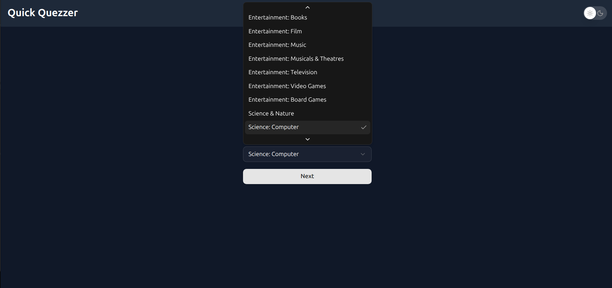
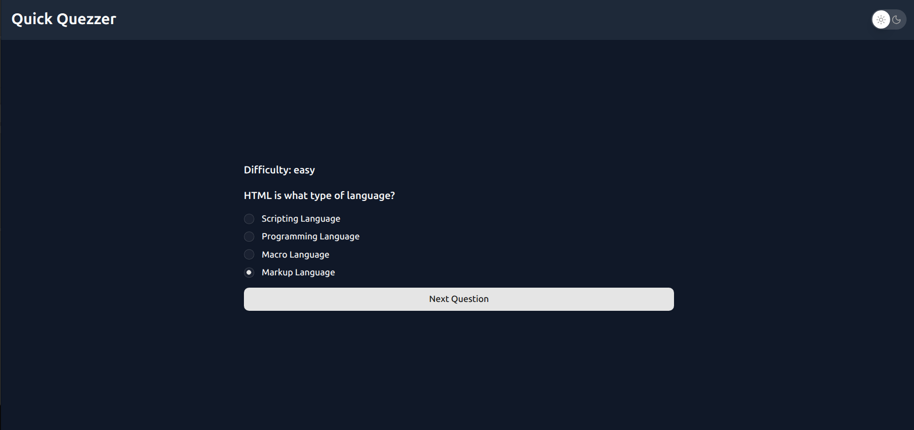

# Quick Quezzer




## 🚀 Tech Stack

- [react](https://react.org/)
- [Tailwind CSS](https://tailwindcss.com/)
- [shadcn/ui](https://ui.shadcn.com/)
- [Lucide Icons](https://lucide.dev/)
- [opentdb API](https://opentdb.com/api_config.php)

## 📦 Installation

```bash
git clone https://github.com/KamrAnDarmAn/quick-quezzer.git
cd your-repo
```

# Install dependencies

```bash
npm install
```

# Run the app

```bash
npm run dev
```
